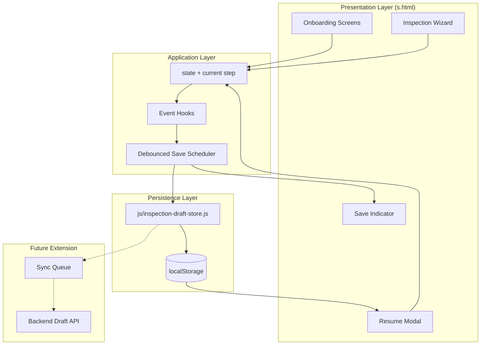
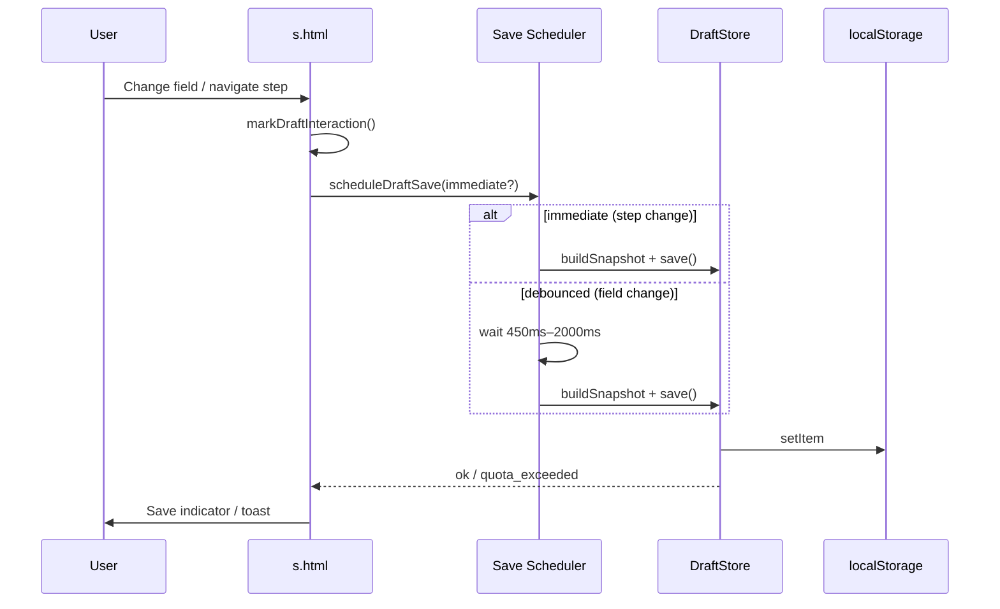
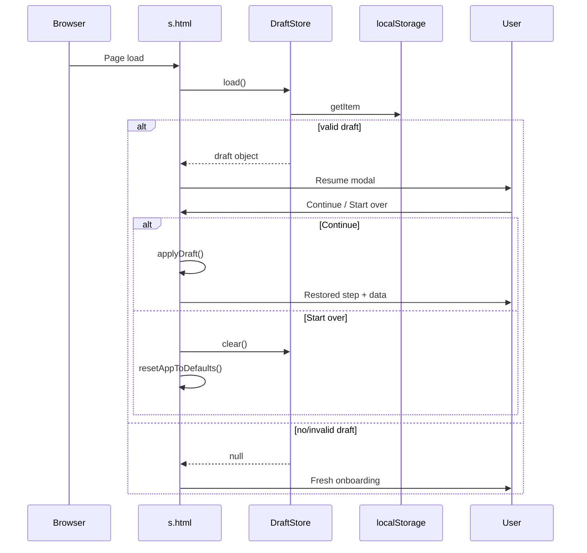
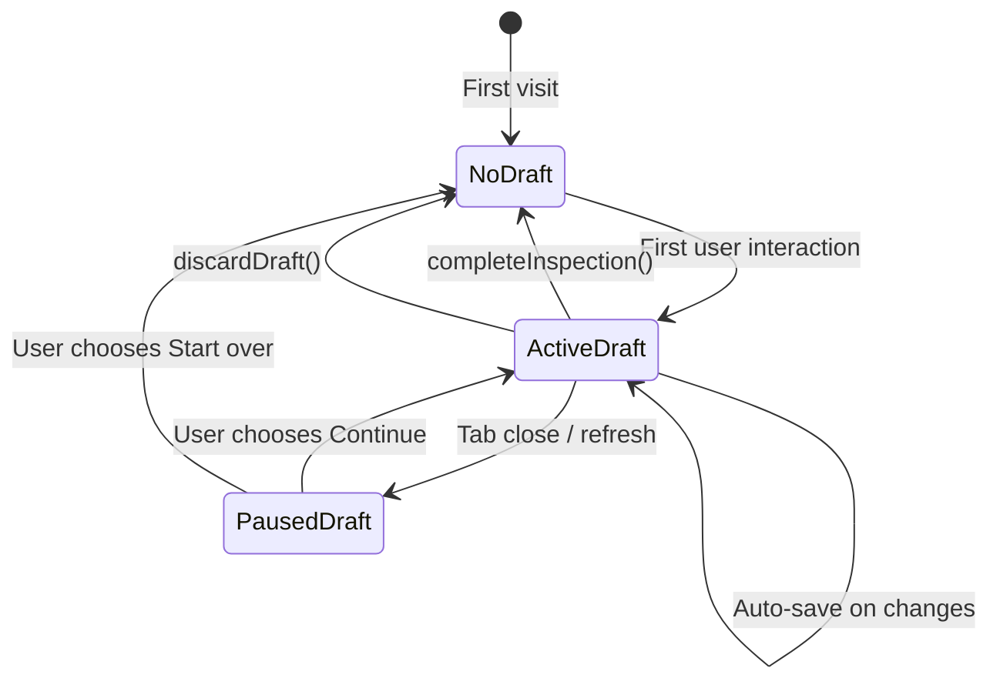
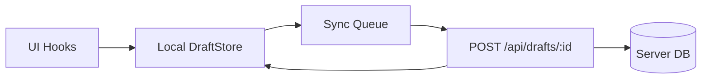

# Resume Progress — Architecture & Implementation Guide

AutoFixia Inspection Wizard (`s.html`) uses **LocalStorage** for client-side draft persistence. This document describes the full architecture, data flow, lifecycle, security posture, and a path to backend synchronization.

---

## 1. Problem Statement

Users may complete onboarding (3 screens) and up to **15 inspection category steps** (16 total phases including onboarding step 4 = inspection). Progress must survive:

- Browser refresh
- Tab close / browser restart
- Temporary loss of internet connectivity
- Accidental navigation away

**LocalStorage** is the persistence layer. Browser HTTP cache is **not** used for form state.

---

## 2. Architecture Overview



### Design principles

| Decision | Choice | Reasoning |
|----------|--------|-----------|
| Storage | `localStorage` | Synchronous, survives refresh, explicit API, no server required |
| Not cache | HTTP cache excluded | Cache is for assets; eviction is opaque and unsuitable for user data |
| Module boundary | `InspectionDraftStore` | UI stays thin; persistence logic is testable and swappable |
| Save strategy | Debounce + throttle | Field changes debounced (~450ms); step navigation saves immediately; max interval ~2s |
| Photo storage | Base64 `dataUrl` in draft | Blob URLs are session-only and cannot be restored after reload |
| Version field | `schemaVersion: 1` | Enables safe migration or discard when form structure changes |

---

## 3. Folder / Module Structure

```
screen designs/
├── s.html                          # Main app + UI hooks + resume modal
├── js/
│   └── inspection-draft-store.js   # Draft load/save/validate/clear API
└── docs/
    └── resume-progress-architecture.md
```

### `InspectionDraftStore` public API

| Method | Purpose |
|--------|---------|
| `load()` | Read and validate draft from LocalStorage; returns `null` if missing/invalid |
| `save(draft)` | Validate and persist; returns `{ ok, error? }` |
| `clear()` | Remove draft (submit or start over) |
| `hasDraft()` | Boolean check for resume modal |
| `validate(draft)` | Structural validation |
| `buildSnapshot(ctx)` | Serialize live app state (called from UI layer) |
| `stripPhotoData(draft)` | Fallback when `QuotaExceededError` |

The UI layer owns **when** to save; the store owns **how** to persist safely.

---

## 4. Draft Data Structure

```json
{
  "schemaVersion": 1,
  "status": "in_progress",
  "updatedAt": "2026-06-12T14:30:00.000Z",
  "phase": "inspection",
  "onboarding": {
    "screen": "vehicle",
    "customer": "Muhammad Sheraz",
    "vehicleIndex": 0,
    "inspectionTypeIndex": 2
  },
  "inspection": {
    "currentStep": 10,
    "sidebarCollapsed": false,
    "points": {
      "Body Panels Condition": {
        "score": 85,
        "status": "Good",
        "noteText": "Minor scratch on rear door",
        "treadDepth": 6,
        "brakeThickness": 6,
        "photos": [
          {
            "id": 1718200000123.45,
            "name": "photo.jpg",
            "size": "240 KB",
            "dataUrl": "data:image/jpeg;base64,..."
          }
        ]
      }
    }
  },
  "sync": {
    "remoteId": null,
    "syncStatus": "local_only",
    "lastSyncedAt": null
  }
}
```

### Field semantics

| Field | Description |
|-------|-------------|
| `phase` | `onboarding` or `inspection` |
| `onboarding.screen` | `customer` \| `vehicle` \| `inspectionType` |
| `inspection.currentStep` | Zero-based category index (display step = index + 1) |
| `inspection.points` | Map of inspection point name → persisted fields only |
| `status` | `in_progress` until submit; then draft is **deleted** |
| `sync.*` | Reserved for backend sync (no runtime behavior today) |

### Intentionally excluded from draft

- Transient UI: `notes` panel open, `photosOpen`
- Voice recognition session state
- Lightbox / camera modal state
- Blob object URLs (converted to `dataUrl` before save)

---

## 5. Data Flow

### 5.1 Auto-save flow



### 5.2 Restore flow



---

## 6. State Management Approach

`s.html` uses a **single in-memory state object** (`state`) keyed by inspection point name, plus scalar globals:

- `current` — active category step (0–14)
- `selectedCustomer`, onboarding screen visibility
- `sidebarCollapsed`

**Draft persistence is a side effect**, not the source of truth during editing:

1. User edits → memory state updates immediately (responsive UI)
2. Scheduler writes a snapshot to LocalStorage asynchronously
3. On reload → snapshot hydrates memory state once

This avoids reading LocalStorage on every keystroke and keeps rendering fast.

---

## 7. Draft Lifecycle



| Event | Action |
|-------|--------|
| First field/step interaction | `draftInteractionActive = true`; create draft |
| Field change | Debounced save |
| Step next/prev/sidebar jump | Immediate save |
| `beforeunload` / `visibilitychange hidden` | Flush pending save |
| Page load + valid draft | Show resume modal |
| User: Continue | `applyDraft()` |
| User: Start over | `clear()` + `resetAppToDefaults()` |
| Form submitted successfully | `completeInspection()` → `clear()` |

---

## 8. Auto-save Strategy

| Trigger | Save mode |
|---------|-----------|
| Slider / status / comment textarea | Debounced (~450ms) |
| Photo add/remove | Debounced after `dataUrl` ready |
| Onboarding navigation | Immediate |
| `nextCat()` / `prevCat()` / category sidebar click | Immediate |
| `startInspection()` | Immediate |
| Tab hidden / page unload | Immediate flush |

**Throttle:** If saves occur faster than every ~2 seconds from rapid input, delay is extended to reduce write churn.

**Quota handling:** On `QuotaExceededError`, photos are stripped and text/scores are saved again. User sees: *"Progress saved (photos omitted — storage limit)"*.

---

## 9. Error Handling Strategy

| Scenario | Behavior |
|----------|----------|
| Corrupt JSON in LocalStorage | `catch` → `clear()` → start fresh |
| Failed `validate()` | Discard draft, log warning |
| `schemaVersion` mismatch | Discard (future: migration layer) |
| `currentStep` out of range | Clamp to `[0, categoryCount - 1]` on restore |
| Missing point keys in draft | Keep defaults for new form fields |
| Missing `dataUrl` on photos | Skip photo on restore; metadata may remain |
| `QuotaExceededError` | Retry without photo binary |
| `localStorage` disabled (private mode) | Save fails silently with toast; app still works in-session |

---

## 10. User Experience

### Resume modal (on load)

- Title: *Unfinished inspection found*
- Meta: last saved timestamp + step label
- Actions: **Continue where I left off** | **Start over**

### Save feedback

- Green pill indicator: *Progress saved* (fades after ~2.2s)
- Toast on quota fallback or save failure

### Submit / complete

Call `completeInspection()` when the inspection is successfully submitted to clear the draft.

---

## 11. Security Considerations

### Safe to store in LocalStorage (this app)

- Customer name (display label)
- Vehicle / inspection type **indices** (not credentials)
- Inspection scores, statuses, comments
- Photo thumbnails (base64) — **sensitive from a privacy perspective**

### Do NOT store in LocalStorage

| Data | Risk |
|------|------|
| Passwords, API keys, auth tokens | XSS can exfiltrate tokens; use HttpOnly cookies for auth |
| Payment card data | PCI violation |
| Government ID numbers | PII exposure on shared devices |
| Full-resolution unredacted customer PII bundles | Device theft / shared tablet risk |

### Risks of LocalStorage

1. **XSS** — any script on the page can read all drafts
2. **Shared devices** — drafts persist until cleared
3. **No encryption** — data is plaintext
4. **5–10 MB quota** — large photo sets may fail

### Mitigations

- Sanitize rendered HTML (`escHtml` for comments)
- Content Security Policy in production
- Strip or compress photos; cap stored photo count (currently 24 data URLs max in snapshot)
- Clear draft on successful submit
- Offer explicit **Start over**
- For production: move drafts to **authenticated backend** with encrypted storage

---

## 12. Future Backend Synchronization Strategy

The draft schema already includes a `sync` block. Extension path without refactoring UI hooks:



### Recommended phases

1. **Phase 1 (current):** LocalStorage only — offline-first, zero infra
2. **Phase 2:** On save, `POST` draft to server; store `sync.remoteId`
3. **Phase 3:** On load, prefer newest of `local.updatedAt` vs `remote.updatedAt`
4. **Phase 4:** Conflict resolution (last-write-wins or merge per field)
5. **Phase 5:** Upload photos to object storage; store URLs instead of base64

### API sketch

```
POST   /api/inspection-drafts          → create
PUT    /api/inspection-drafts/:id    → upsert
GET    /api/inspection-drafts/:id    → restore
DELETE /api/inspection-drafts/:id    → discard
```

`InspectionDraftStore.save()` would gain an optional `syncAdapter` dependency injected at init — the UI scheduler code stays unchanged.

---

## 13. Draft Version Migration

When form fields or categories change:

1. Bump `SCHEMA_VERSION` in `inspection-draft-store.js`
2. Add `migrate(v0) → v1` function
3. If migration impossible, show modal: *"Your saved progress is from an older version and cannot be restored."*

---

## 14. Tradeoffs Summary

| Approach | Pros | Cons |
|----------|------|------|
| LocalStorage | Simple, offline, instant | Quota limits, plaintext, per-browser |
| sessionStorage | Auto-clears on tab close | Loses progress on browser restart — **rejected** |
| IndexedDB | Larger quota, structured | More complex API — good future upgrade for photos |
| Backend-only | Secure, cross-device | Requires network — poor offline UX |
| Debounced save | Fewer writes | Up to ~450ms delay before persistence (mitigated by unload flush) |

---

## 15. Integration Checklist (s.html)

- [x] `js/inspection-draft-store.js` loaded
- [x] Resume modal on load
- [x] Debounced + immediate save hooks
- [x] Onboarding + inspection phase tracking
- [x] Photo `dataUrl` capture for restore
- [x] `beforeunload` / `visibilitychange` flush
- [x] `completeInspection()` for submit integration
- [x] `discardDraft()` / `resetAppToDefaults()`
- [ ] Wire `completeInspection()` to final submit button when added

---

## 16. Testing Scenarios

1. Fill Step 3 onboarding → refresh → resume onboarding screen
2. Complete inspection Step 11 → refresh → land on Step 11 with data
3. Edit slider + comment → refresh → values restored
4. Add photo → refresh → photo visible (within quota)
5. Start over → draft cleared → fresh onboarding
6. Corrupt LocalStorage key → app starts clean
7. Airplane mode → edits persist locally (no network required)

---

*Storage key:* `autofixia_inspection_draft_v1`
